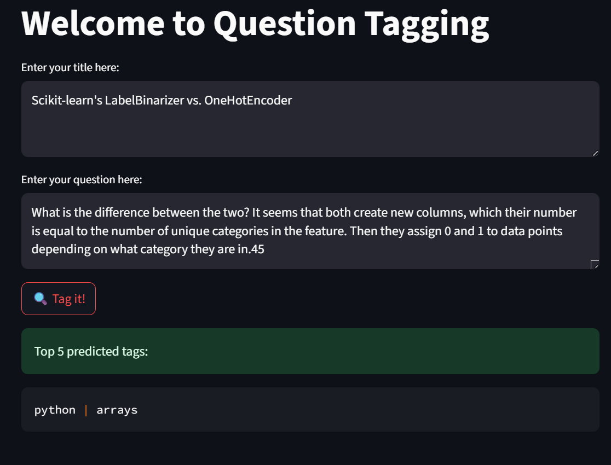
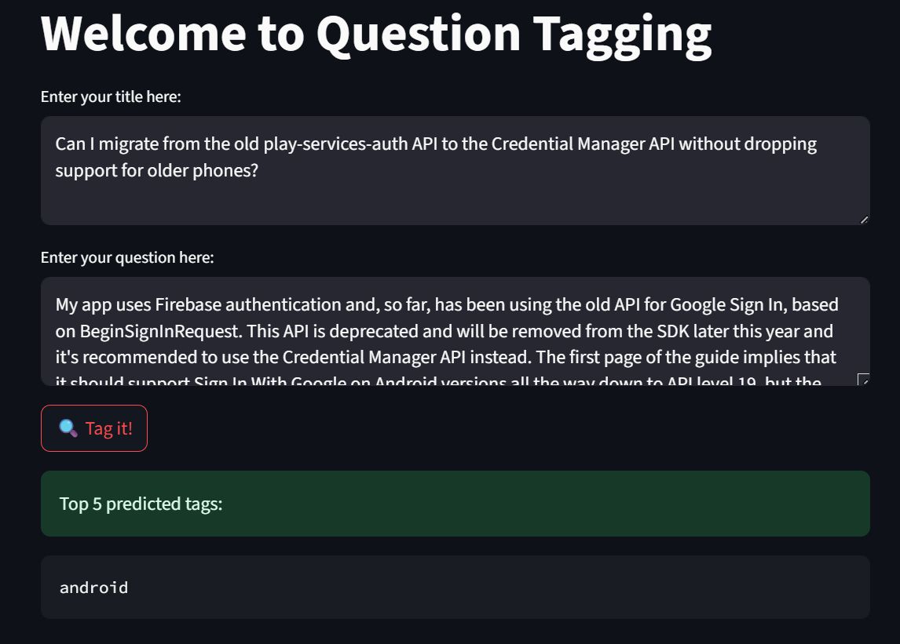

# 💬 Stack Overflow Question Tagging - NLP Classification Project

This project is a Natural Language Processing (NLP) application that automatically tags Stack Overflow questions based on their content. It uses classical machine learning models (Logistic Regression and Naive Bayes) along with TF-IDF vectorization to classify the questions into predefined tags. A simple and interactive GUI is built using **Streamlit**.

---

## Features

- **TF-IDF** for transforming textual data into numerical features  
-  **Logistic Regression** and **Naive Bayes** classifiers  
-  Logistic Regression achieved the **highest accuracy**  
-  Built-in **Streamlit GUI** for easy interaction  
-  Real-time question tagging from user input  

---

## 📸 GUI Preview

  

  

---

##  Model Training

We explored and compared two models:

- **Multinomial Naive Bayes**
- **Logistic Regression** *(Best performance)*

TF-IDF was used to vectorize the text data. After evaluating both models, Logistic Regression showed superior performance in terms of accuracy and generalization.

---

##  Results

| Model               | Accuracy  |
|---------------------|---------- |
| Naive Bayes         | 45.5%     |
| Logistic Regression | **51.3%** |

---

